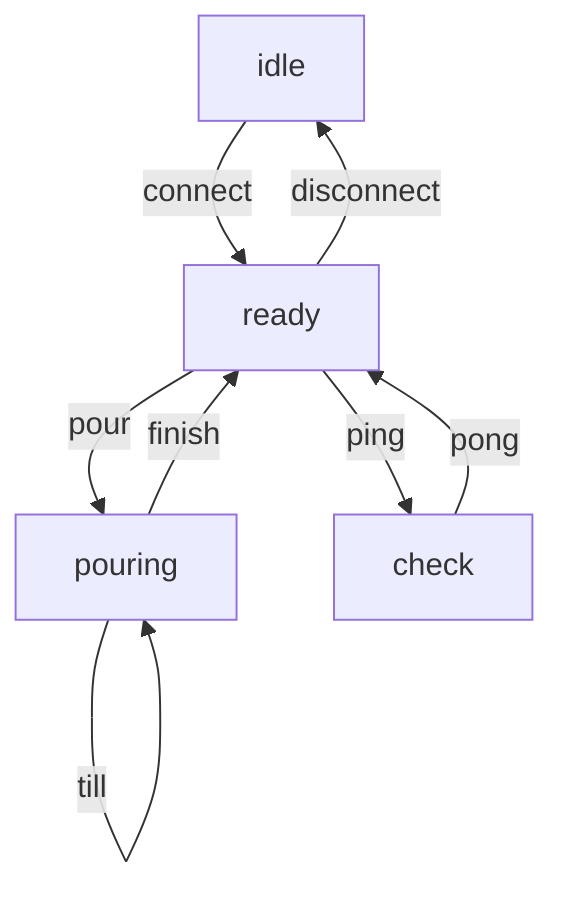

# Protocol

## Finite State Automaton

Cap behavior

```mermaid
graph TD;
  Z[idle];
  A[ready];
  B[pouring];
  C[check];

  Z -->|connect| A;

  A -->|disconnect| Z;
  
  A -->|pour| B;

  B -->|till| B;

  B -->|finish| A;

  A -->|ping| C;
  C -->|pong| A;
```